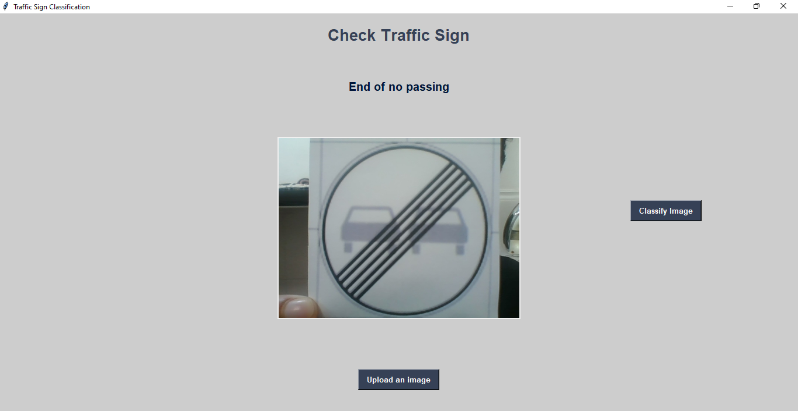

This part of the project is dedicated to **Traffic Sign Recognition**.
It utilizes a pre-trained model that was **created and trained in the folder `create_traffic_sign_model/models`**.
The trained model file, named `best_model.h5`, is a **Convolutional Neural Network (CNN)** capable of recognizing **43 different types of traffic signs**.

The provided code implements a simple **Graphical User Interface (GUI)** using **Tkinter**, allowing users to upload an image of a traffic sign. The model then classifies the image and displays the predicted sign name.

### 🔧 Technical Details

* The model is loaded from the following path:

  ```
  create_traffic_sign_model/models/best_model.h5
  ```
* The model was trained using the **GTSRB (German Traffic Sign Recognition Benchmark)** dataset.
* When an image is uploaded, the program resizes it to **30×30 pixels** using `PIL`, processes it with NumPy, and passes it to the model for prediction.
* The model’s output corresponds to a numeric class index, which is mapped to the appropriate label (e.g., “Stop”, “Speed limit 60 km/h”, “Yield”, etc.) using the `classes` dictionary.

### 🎯 Purpose

This module represents an **initial test version** of the **Traffic Sign Recognition system**, designed to eventually integrate with the **Lane Detection module** as part of a larger **Autonomous Driving System**.
Although it currently runs as a standalone GUI-based demo, the structure allows for future expansion — including **real-time video stream processing and full-scale autonomous navigation integration**.


### 🖼️ GUI Preview
The user interface for testing the traffic sign recognition model is shown below:


